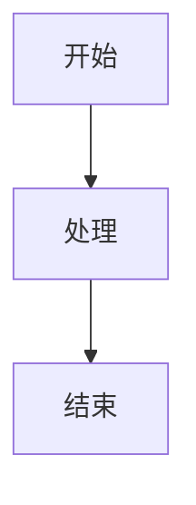

# lightMarkDown
一个轻量的markdown编辑器，全部由Trae生成，支持实时预览和一些简单的Markdown扩展功能。

## 功能特点

- 🚀 实时协作编辑
- 📝 即时Markdown预览
- 🎨 代码语法高亮
- 📊 Mermaid图表支持
- 📐 KaTeX数学公式
- 🎯 自动文本格式化
- 💻 跨平台支持（Web + 桌面应用）

## 技术栈

- 前端框架：Vue 3
- 构建工具：Vite
- 实时通信：Socket.IO
- Markdown解析：Marked
- 语法高亮：Highlight.js
- 数学公式：KaTeX
- 图表支持：Mermaid
- 桌面支持：Electron

## 快速开始

### 安装依赖

```bash
npm install
```

### 开发模式

启动Web版本：
```bash
npm run dev
```

启动桌面版本：
```bash
npm run electron-dev
```

启动协作服务器：
```bash
npm run server
```

### 构建项目

```bash
npm run build
```

## 使用指南

### Markdown基础语法

支持所有标准Markdown语法，包括：
- 标题（# h1 - ###### h6）
- 列表（有序和无序）
- 链接和图片
- 表格
- 引用
- 代码块

### 扩展功能

#### 数学公式

使用KaTeX语法在代码块中编写数学公式：

```math
E = mc^2
```

#### 图表

使用Mermaid语法创建流程图、时序图等：



#### 代码高亮

支持多种编程语言的语法高亮：

```javascript
console.log('Hello, World!');
```

## 协作功能

1. 启动协作服务器
2. 多个用户可以同时编辑同一文档
3. 实时查看其他用户的编辑内容
4. 自动同步所有用户的修改

## 贡献指南

欢迎提交问题和改进建议！请确保在提交前：

1. 检查现有的Issues
2. 创建新的Issue描述问题或建议
3. 提交Pull Request时附带清晰的描述

## 许可证

本项目基于MIT许可证开源。
